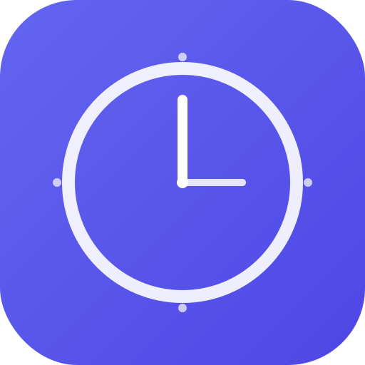

<p align="center">
  
</p>

<h1 align="center">Interval</h1>

<p align="center">
  <strong>A premium, open-source clock, alarm, timer & stopwatch progressive web app.</strong>
</p>

<p align="center">
  <a href="https://achrafthedev.github.io/Interval">Live Demo</a> &nbsp;&middot;&nbsp;
  <a href="#features">Features</a> &nbsp;&middot;&nbsp;
  <a href="#getting-started">Getting Started</a> &nbsp;&middot;&nbsp;
  <a href="#tech-stack">Tech Stack</a>
</p>

<p align="center">
  
  
  
</p>

---

## Why Interval?

Most online clocks feel stuck in 2005 — cluttered with ads, dated segmented fonts, and zero offline support. Interval is built to be the clock app the web deserves: installable, offline-capable, feature-rich, and beautiful on every screen.

## Features

### Clock & World Clock
- Live digital clock with **Orbitron** display font
- Optional **analog clock face** (SVG rendered, toggle in settings)
- **Geolocation auto-detect** — detects your city and timezone with one tap
- **Sunrise & sunset times** calculated from your coordinates
- Add **20+ world cities** with live timezone display
- **Time-distance calculator** showing deltas between all zone pairs
- **Meeting planner time slider** — scrub ±12 hours to coordinate across zones
- **Countdown to date** — track days/hours/minutes/seconds until any event
- 12-hour / 24-hour toggle

### Alarm System
- Multiple concurrent alarms with custom labels
- Weekday, weekend, and per-day **recurrence toggles**
- **8 built-in synthesized alarm tones** across 3 categories (Gentle, Standard, Intense) — all generated via Web Audio API, no external files
- **Live sound preview** in the alarm editor
- **Smart Wake** — gradual volume fade-in over 30 seconds
- **Snooze** (5 minutes) with one tap
- Custom audio URL support for personal sound files
- **Native OS notifications** when the tab is backgrounded
- **Vibration API** support on mobile

### Countdown Timer
- **Quick presets** — Pomodoro (25m), Short Break (5m), Long Break (15m), Tea Steep (3m), Presentation (10m), 1 Minute
- **Custom timer** creation with hours/minutes/seconds input
- **Multiple simultaneous timers** running in parallel
- **Sequence builder** — chain timers into intervals (Work → Rest → Repeat N times) with **auto-advance** between steps
- **Auto-restart / Loop** toggle per timer
- **+1m, +5m, +10m** quick-extend buttons on running timers
- Visual progress bar on each timer card
- **Picture-in-Picture** pop-out for any timer
- Background Web Worker ensures timers fire even in minimized tabs

### Stopwatch
- Sub-centisecond precision via `requestAnimationFrame`
- Dual **Lap Time** + **Split Time** columns side-by-side
- **Delta calculations** between consecutive laps
- Automatic **green/red highlighting** of fastest and slowest laps
- **Web Speech API (TTS)** — optional voice announcing lap times aloud
- **CSV export** of all lap data
- **Picture-in-Picture** pop-out window

### App-Wide
- **3 themes** — OLED Black, Light, Dynamic (time-of-day gradient)
- **Installable PWA** with offline support via service worker
- **Screen Wake Lock** — keeps display on during active timers (auto-activates)
- **Fullscreen mode**
- **Keyboard shortcuts** — `1-4` views, `F` fullscreen, `T` cycle theme
- **Dynamic tab title** showing running timer/stopwatch
- **Full data export/import** (JSON backup of all settings, alarms, timers)
- Responsive layout: sidebar on desktop, bottom nav on mobile
- Zero ads, zero tracking, zero external dependencies at runtime

## Tech Stack

| Layer | Technology |
|-------|-----------|
| Framework | React 19 + TypeScript |
| Build | Vite 6 |
| Styling | Tailwind CSS 3 |
| Audio | Web Audio API (synthesized tones) |
| Speech | Web Speech API |
| Notifications | Web Notifications API |
| Geolocation | Browser Geolocation API + BigDataCloud |
| PiP | Canvas + `captureStream()` + Picture-in-Picture API |
| Persistence | localStorage |
| PWA | Service Worker + Web App Manifest |
| Container | Docker + Docker Compose |
| Deployment | GitHub Pages |

## Getting Started

### With Docker (recommended)

```bash
git clone https://github.com/achrafthedev/Interval.git
cd Interval
docker compose up --build
```

Open [http://localhost:5173](http://localhost:5173).

### Without Docker

```bash
git clone https://github.com/achrafthedev/Interval.git
cd Interval
npm install
npm run dev
```

### Production Build

```bash
npm run build
npm run preview
```

The `dist/` folder contains the static build, ready to deploy anywhere.

## Keyboard Shortcuts

| Key | Action |
|-----|--------|
| `1` | Clock view |
| `2` | Alarm view |
| `3` | Timer view |
| `4` | Stopwatch view |
| `F` | Toggle fullscreen |
| `T` | Cycle theme |

## Project Structure

```
src/
├── components/
│   ├── AlarmView.tsx        # Alarm system with sounds & snooze
│   ├── AnalogClock.tsx      # SVG analog clock face
│   ├── ClockView.tsx        # Main clock, world clock, meeting planner
│   ├── Icons.tsx            # All SVG icons
│   ├── Navigation.tsx       # Responsive sidebar / bottom nav
│   ├── SettingsPanel.tsx    # Settings modal with export/import
│   ├── StopwatchView.tsx    # Stopwatch with laps, TTS, PiP
│   ├── ThemeProvider.tsx    # Theme engine (OLED/Light/Dynamic)
│   └── TimerView.tsx        # Countdown timers with sequences
├── hooks/
│   ├── useAnimationFrame.ts # rAF loop hook
│   ├── useBackgroundTimer.ts# Web Worker + rAF for background reliability
│   ├── useDocumentTitle.ts  # Dynamic tab title
│   ├── useKeyboardShortcuts.ts
│   ├── useLocalStorage.ts   # Persistent state
│   └── useTime.ts           # Real-time clock hook
├── utils/
│   ├── audio.ts             # Custom audio playback
│   ├── geolocation.ts       # Geo-detect + sunrise/sunset
│   ├── notifications.ts     # Web Notifications API
│   ├── pip.ts               # Picture-in-Picture engine
│   ├── sounds.ts            # 8 synthesized alarm tones
│   ├── time.ts              # Formatting, timezone math
│   └── wakelock.ts          # Screen Wake Lock API
├── types.ts
├── App.tsx
├── main.tsx
└── index.css
```

## License

MIT License. See [LICENSE](LICENSE) for details.

---

<p align="center">
  Built with precision by <a href="https://github.com/achrafthedev">achrafthedev</a>
</p>
